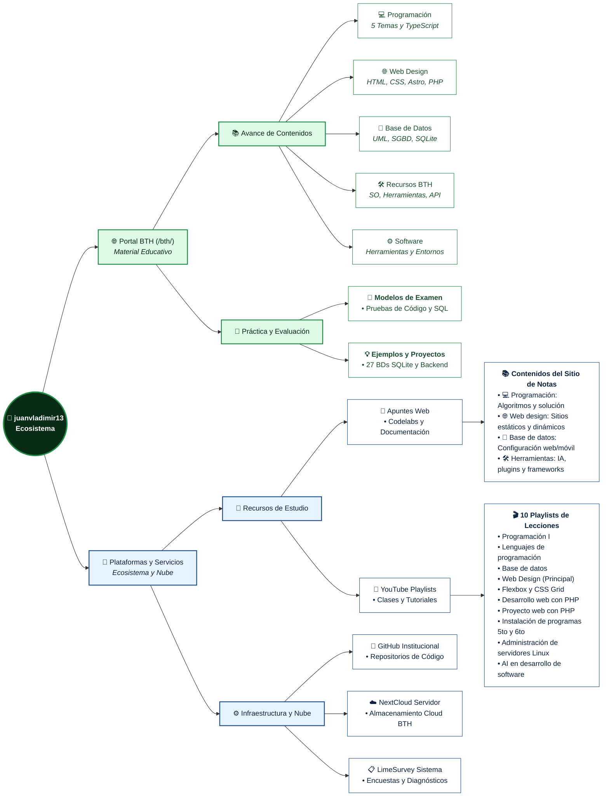

# Esquema de trabajo
*Sitio Web:* [https://juanvladimir13.web.app](https://juanvladimir13.web.app/) | *Portal BTH:* [https://juanvladimir13.web.app/bth/](https://juanvladimir13.web.app/bth/)

---

## Flujo de trabajo del Ecosistema

---

### Descripción de Nodos y Enlaces Directos

#### 🌐 Rama 1: Portal BTH (`/bth/`)
- **Portal Principal:** [https://juanvladimir13.web.app/bth/](https://juanvladimir13.web.app/bth/) — Portal del Bachillerato Técnico Humanístico (BTH) en Sistemas Informáticos.
- **📚 Avance de Contenidos (Materias y Software):**
  - 💻 [Programación](https://juanvladimir13.web.app/bth/programacion): Conceptos, Álgebra de Boole, Ofimática, Introducción a la programación y Arrays de datos.
  - 🌐 [Web Design](https://juanvladimir13.web.app/bth/webdesign): HTML5, CSS3, Flexbox, Grid, DOM, LocalStorage, Astro y PHP.
  - 💾 [Base de Datos](https://juanvladimir13.web.app/bth/database): Fundamentos UML, SGBD/ACID, Motor SQLite y DDL/DML.
  - 🛠️ [Recursos](https://juanvladimir13.web.app/bth/recursos): Sistema Operativo, Compiladores e Intérpretes, BIOS/UEFI y particionado.
  - ⚙️ [Software](https://juanvladimir13.web.app/bth/software/): Catálogo de herramientas y entornos clasificados (Bun, Deno, VS Code, SQLite, DB Browser, GIMP, editores de texto).
- **🎯 Práctica y Evaluación:**
  - 📝 **Modelos de Examen:** Pruebas formativas prácticas en TypeScript, SQL, CSS y PHP.
  - 💡 **Ejemplos y Proyectos:** Colección de 27 bases de datos SQLite reales, repositorio de API REST backend y plantilla frontend Astro con Bun.

---

#### 🔗 Rama 2: Plataformas y Servicios Externos
- **📖 Recursos de Estudio:**
  - 📝 **Apuntes Web:** [juanvladimir13notes.web.app](https://juanvladimir13notes.web.app/) — Codelabs y notas en 4 secciones ([Programación](https://juanvladimir13notes.web.app/programacion/), [Web design](https://juanvladimir13notes.web.app/webdesign/), [Base de datos](https://juanvladimir13notes.web.app/database/), [Herramientas](https://juanvladimir13notes.web.app/tools/)).
  - 🎥 **YouTube:** [youtube.com/@juanvladimir13/playlists](https://www.youtube.com/@juanvladimir13/playlists) — 10 listas de reproducción de lecciones grabadas de cada asignatura:
    - 🎥 [Lecciones: Programación I](https://www.youtube.com/playlist?list=PLJGxuT2YtlhjRxXCtKtnoNAOv5RG5qkvl)
    - 🎥 [Lecciones: Lenguajes de programación](https://www.youtube.com/playlist?list=PLJGxuT2Ytlhj8K0N_t44uz_DtuwN2TaRW)
    - 🎥 [Lecciones: Base de datos](https://www.youtube.com/playlist?list=PLJGxuT2YtlhjUUuADW4b66gjJ1wX_Zkla)
    - 🎥 [Lecciones: Web Design (Playlist Principal)](https://www.youtube.com/playlist?list=PLJGxuT2YtlhiBOpZvru_yE4oiUJEWcTsj)
    - 🎥 [Lecciones: Flexbox y CSS Grid](https://www.youtube.com/playlist?list=PLJGxuT2YtlhjE2qGn1J5E-U0K38njk_qk)
    - 🎥 [Lecciones: Desarrollo web con PHP sin framework](https://www.youtube.com/playlist?list=PLJGxuT2YtlhiZBMXcHu3dM4GUBouqS5CH)
    - 🎥 [Lecciones: Proyecto web con PHP](https://www.youtube.com/playlist?list=PLJGxuT2Ytlhg4x7MxLHzC9wz3wpJvHG5j)
    - 🎥 [Lecciones: Instalación de programas 5to Sistemas Informáticos](https://www.youtube.com/playlist?list=PLJGxuT2YtlhhV9L8uyqycWLhGkrPw3YcP)
    - 🎥 [Lecciones: Instalación de programas 6to Sistemas Informáticos](https://www.youtube.com/playlist?list=PLJGxuT2YtlhgzTbzfvCU4VUr3W5tTe1pT)
    - 🎥 [Lecciones: Administración de servidores GNU/Linux](https://www.youtube.com/playlist?list=PLJGxuT2YtlhjEeB8WpzUPDPUcgMPbGw2t)
    - 🎥 [Lecciones: AI en el desarrollo de software](https://www.youtube.com/playlist?list=PLPFoP4zb2JH4)
- **⚙️ Infraestructura y Nube (Nodos Directos):**
  - 🐙 **GitHub:** [github.com/sistemasinformaticossanjulian](https://github.com/sistemasinformaticossanjulian) — Organización con repositorios de código abierto de los estudiantes.
  - ☁️ **NextCloud:** [bthsanjulian.website:8021](https://bthsanjulian.website:8021/) — Almacenamiento en la nube institucional para imágenes y software.
  - 📋 **LimeSurvey:** [bthsanjulian.website:7777](https://bthsanjulian.website:7777) — Evaluaciones diagnósticas y encuestas de satisfacción académica.
